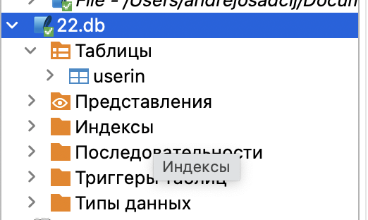
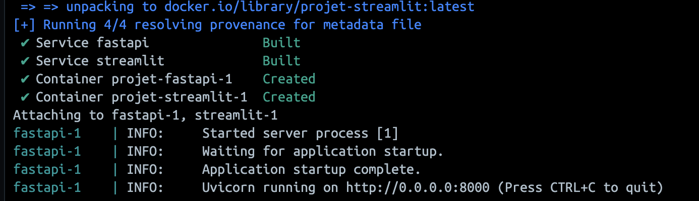
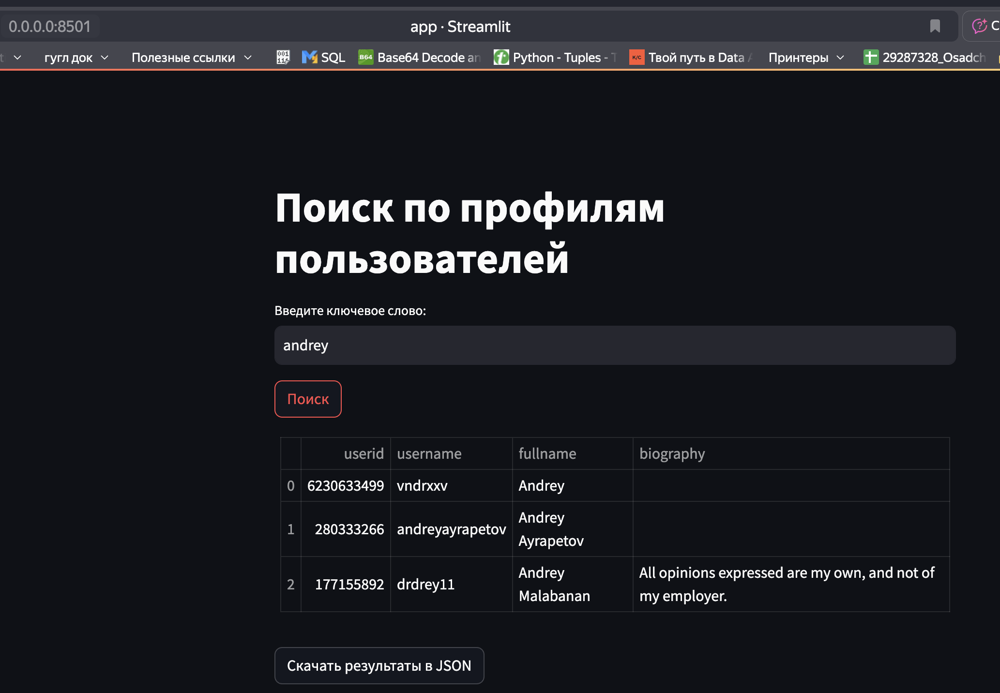
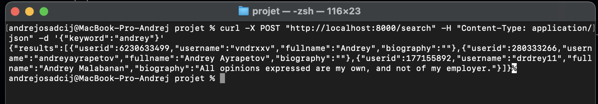
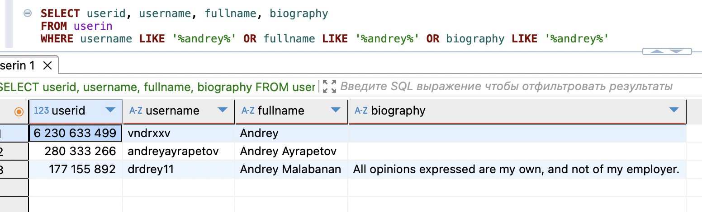

# Разработка веб-приложения с использованием Streamlit и FastAPI
## Цель: Создать веб-приложение на платформе Streamlit, которое будет взаимодействовать с сервером на FastAPI для обработки запросов и извлечения данных из базы данных SQLite.

## Особенности
- 🔍 **Поиск**: Нечувствительный к регистру поиск по текстовым полям (`username`, `fullname`, `biography`) в таблице `userin` (103 851 строки).
- 📊 **Интерфейс**: Streamlit с вводом ключевых слов, таблицей результатов и кнопкой для скачивания JSON.
- ⚡ **Backend**: FastAPI с эндпоинтом `/search` для быстрого поиска.
- 🗄 **База данных**: SQLite (`22.db`) с оптимизацией через индексы для ускорения поиска.
- 🐳 **Контейнеризация**: Docker с сервисами `fastapi` и `streamlit` для простого запуска.


## Технологии
- Python 3.10
- Streamlit 1.31.0
- FastAPI 0.115.0
- SQLite
- Docker & Docker Compose
- Pandas 2.2.3
- DBeaver (для проверки данных)

## Архитектура
- **Frontend**: Streamlit (`http://localhost:8501`) — ввод ключевых слов, отображение таблицы, скачивание JSON.
- **Backend**: FastAPI (`http://localhost:8000/search`) — обработка поисковых запросов.
- **База данных**: SQLite (`22.db`, таблица `userin`) — хранение профилей пользователей.
- **Контейнеризация**: Docker с двумя сервисами (`fastapi`, `streamlit`) и монтированием базы данных.

## Структура проекта
```bash
├── main.py              # FastAPI сервер
├── app.py               # Streamlit приложение
├── 22.db                # SQLite база данных
├── requirements.txt     # Зависимости
├── Dockerfile.fastapi   # Dockerfile для FastAPI
├── Dockerfile.streamlit # Dockerfile для Streamlit
├── docker-compose.yml   # Конфигурация Docker
├── README.md            # Описание проекта
  ```
 
## Установка и запуск
### Что неоьбходимо чтобы всё встало
- Docker и Docker Compose
- DBeaver (не обязателеьно, можно любое другое по для бд)
### Шаги
1. **Клонируем репозиторий**:
   ```bash
   git clone https://github.com/andrey-osadchiy/seminar_nastavnika/praktika.git
   cd user-profile-search
   ```
2. **Подготовливаем базу данных**:
   - Поместите файл `22.db` с таблицей `userin` в корневую папку проекта или создаём таблицу с помощью `init_db.sql`:
     ```bash
     sqlite3 22.db < init_db.sql
     ```
     
3. **Запускаем приложение**:
   ```bash
   docker compose up --build
   ```
    
   - FastAPI: `http://localhost:8000`
   - Streamlit: `http://localhost:8501`
   - Заходим в Streamlit и вводим слово что хотим найти
     
   - Проверьте эндпоинт /search
     ```bash
     curl -X POST "http://localhost:8000/search" -H "Content-Type: application/json" -d '{"keyword":"andrey"}'
     ```
     
4. **Проверяем данные** (опционально):
   - Подключаемся к `22.db` в DBeaver.
   - Выполняем запрос:
     ```sql
     SELECT userid, username, fullname, biography 
     FROM userin 
     WHERE username LIKE '%andrey%' OR fullname LIKE '%andrey%' OR biography LIKE '%andrey%' 
     LIMIT 100;
     ```


---
*Проект создан как часть учебной практики по разработке и дата-инженерии.*
