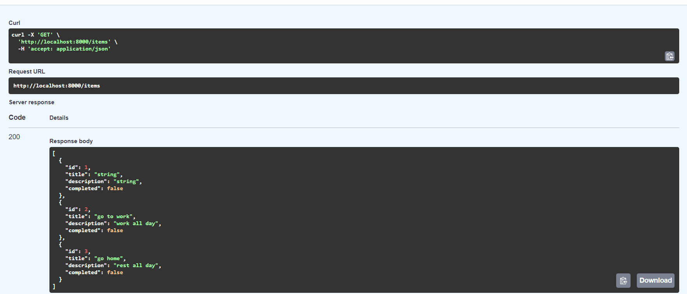

# Проект Todo API

## Описание
Этот проект предоставляет RESTful API для управления списком задач (Todo). С использованием FastAPI, SQLAlchemy и Pydantic, приложение позволяет пользователям выполнять следующие действия:
- Создавать задачи.
- Читать список задач или отдельные задачи.
- Обновлять существующие задачи.
- Удалять задачи.
- Фильтровать задачи по дате, искать задачи и управлять их статусом выполнения.

## Основные возможности

### Получение всех задач
- **Эндпоинт:** `GET /items`
- **Описание:** Возвращает список всех задач.




### Получение задачи по ID
- **Эндпоинт:** `GET /items/{item_id}`
- **Описание:** Возвращает задачу по её уникальному идентификатору.

### Создание новой задачи
- **Эндпоинт:** `POST /items`
- **Описание:** Принимает данные задачи (название, описание, статус выполнения) и добавляет её в базу данных.

### Обновление существующей задачи
- **Эндпоинт:** `PUT /items/{item_id}`
- **Описание:** Позволяет изменить информацию о задаче.

### Удаление задачи
- **Эндпоинт:** `DELETE /items/{item_id}`
- **Описание:** Удаляет задачу по её уникальному идентификатору.

## Технологии
- **FastAPI:** Фреймворк для создания API.
- **SQLAlchemy:** ORM для работы с базой данных.
- **Pydantic:** Для валидации данных.
- **Uvicorn:** ASGI сервер для запуска приложения.

## Примеры запросов

### Создание задачи
```bash
curl -X 'POST' \
  'http://localhost:8000/items' \
  -H 'accept: application/json' \
  -H 'Content-Type: application/json' \
  -d '{
  "title": "go home",
  "description": "rest all day",
  "completed": false
}'

### Получение всех задач
curl -X 'GET' \
  'http://localhost:8000/items' \
  -H 'accept: application/json'

### Удаление задачи
curl -X 'DELETE' \
  'http://localhost:8000/items/2' \
  -H 'accept: application/json'


