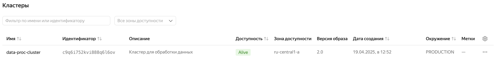
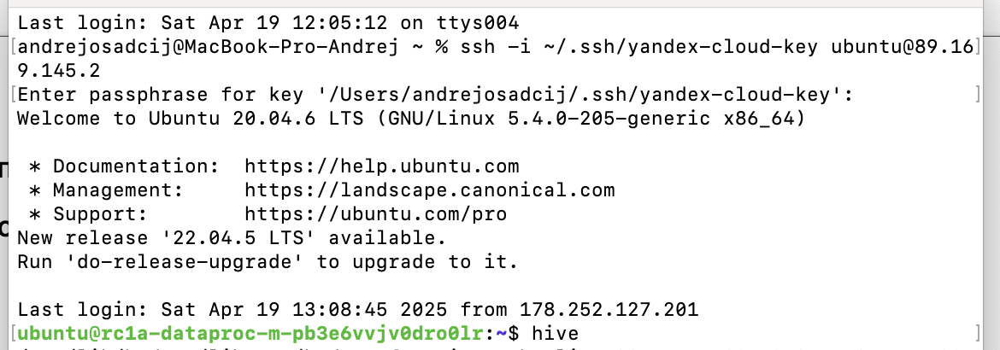

# Обработка и анализ данных в Yandex Cloud
## Описание
1. В рамках первого задания через сервис Yandex Cloud необходимо поднять кластер с установленным (Hadoop + Hive/Spark).

- Создать таблицы с помощью Hive;
- Заполнить таблицы данными из TXT и CSV файлов (предварительно разместите файлы в Object Storage);
- Выполнить несколько различных агрегаций на основе созданных таблиц
2. В рамках второго задания опять через сервис Yandex Cloud необходимо поднять систему ClickHouse
- Создать таблицы;
- Заполнить данными из TXT и CSV файлов (используйте INSERT или предварительно разместите файлы в Object Storage);
- Выполнить несколько агрегаций;

  ## Задание 1
  1) Разворачиваем кластер при помощи Yandex Cloud
     
 
 
  2) Подключаемся через терминал

 
 
