# Обработка и анализ данных в Yandex Cloud
## Описание
1. В рамках первого задания через сервис Yandex Cloud необходимо поднять кластер с установленным (Hadoop + Hive/Spark).

- Создать таблицы с помощью Hive;
- Заполнить таблицы данными из TXT и CSV файлов (предварительно разместите файлы в Object Storage);
- Выполнить несколько различных агрегаций на основе созданных таблиц
2. В рамках второго задания опять через сервис Yandex Cloud необходимо поднять систему ClickHouse
- Создать таблицы;
- Заполнить данными из TXT и CSV файлов (используйте INSERT или предварительно разместите файлы в Object Storage);
- Выполнить несколько агрегаций;


  ## Задание 1

 (!) Все используемые запросы представлены в папке [query]([https://www.example.com](https://github.com/andrey-osadchiy/seminar_nastavnika/tree/main/yandex_cloud_hw1/query))

 Разворачиваем кластер при помощи Yandex Cloud
 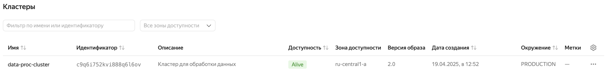
 
 Загружаем файлы в Object storage
 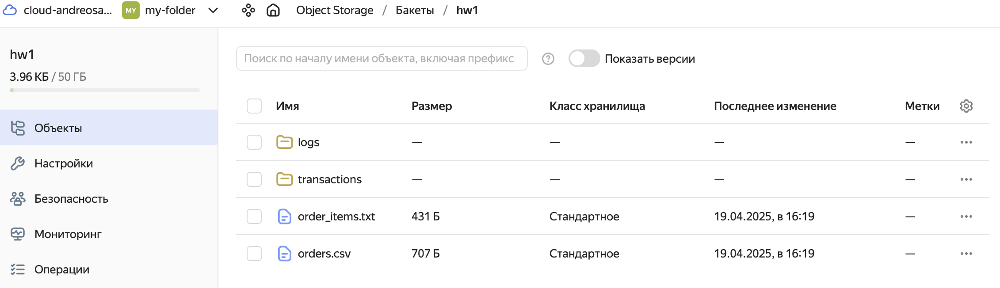
 
 Подключаемся через терминал, запускаем hive
 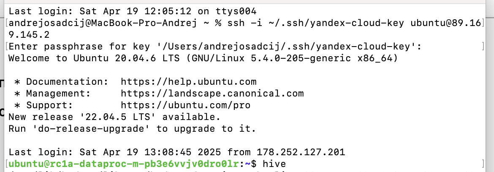
 
 Создаём таблицы transactions_v2 и logs_v2 и заполняем их данными из файлов из Object storage
 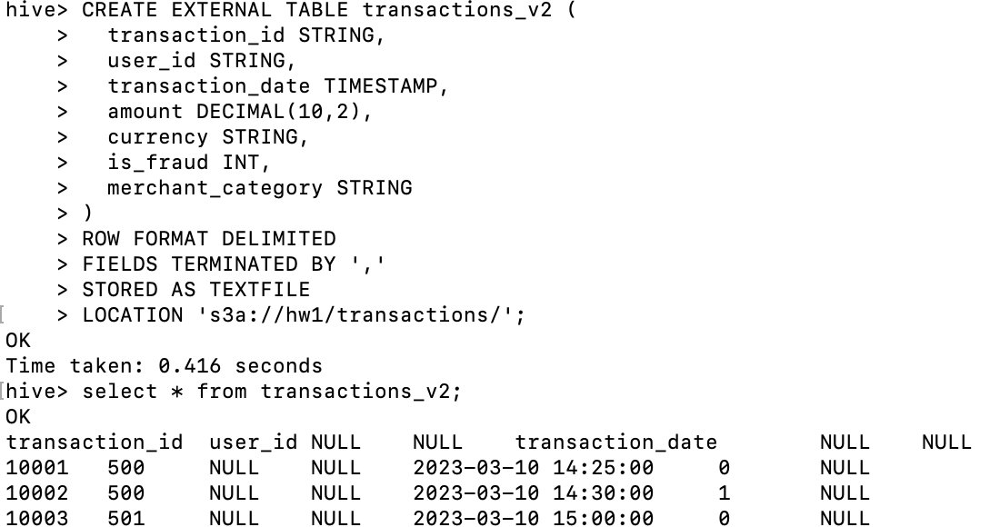
 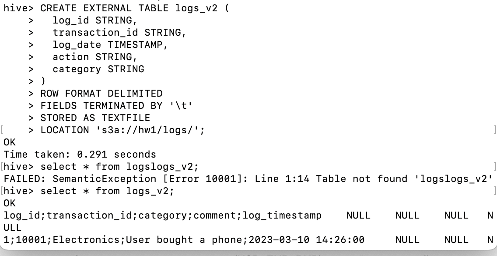
 
 Выполнем требуемые запросы
 - Фильтрация «хороших» валют (USD, EUR, RUB), подсчёт суммарной суммы транзакций по каждой валюте:
```sql
SELECT currency, SUM(amount) as total_amount
FROM transactions_v2
WHERE currency IN ('USD', 'EUR', 'RUB')
GROUP BY currency;
``` 
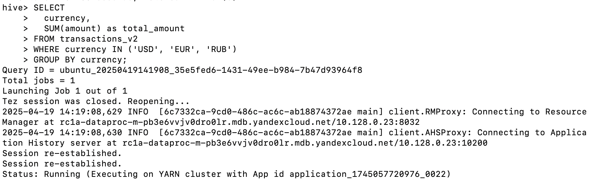

Результат: 
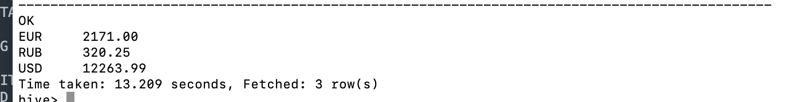

- Подсчёт количества мошеннических (is_fraud=1) и нормальных (is_fraud=0) транзакций, суммарной суммы и среднего чека:
``` sql
SELECT is_fraud, COUNT(*) as count,
    SUM(amount) as total,
    AVG(amount) as avg_amount
FROM transactions_v2
GROUP BY is_fraud;
```
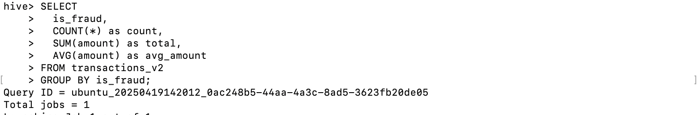

Результат:
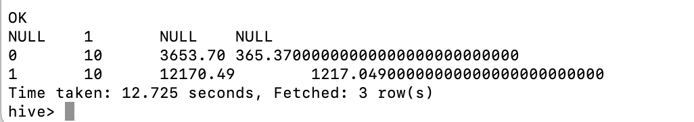

- Группировка по датам с вычислением ежедневного количества транзакций, суммарного объёма и среднего amount:

``` sql
SELECT DATE(transaction_date) AS day,
COUNT(*) AS transactions_count,
SUM(amount) AS total_amount,
AVG(amount) AS avg_amount,
SUM(CASE WHEN is_fraud = 1 THEN 1 ELSE 0 END) AS fraud_count
FROM transactions_v2
GROUP BY DATE(transaction_date)
ORDER BY day;
```
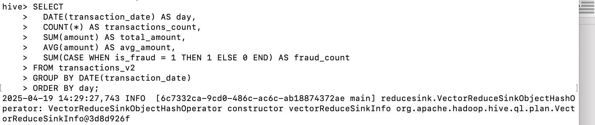

Результат:
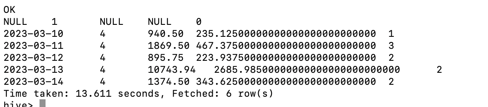

- Использование временных функций (например, извлечение дня/месяца из transaction_date) и анализ транзакций по временным интервалам:

``` sql
 SELECT  MONTH(transaction_date) AS month, YEAR(transaction_date) AS year, COUNT(*) AS transactions_count
  FROM transactions_v2
  GROUP BY YEAR(transaction_date), MONTH(transaction_date)
  ORDER BY year, month;
```

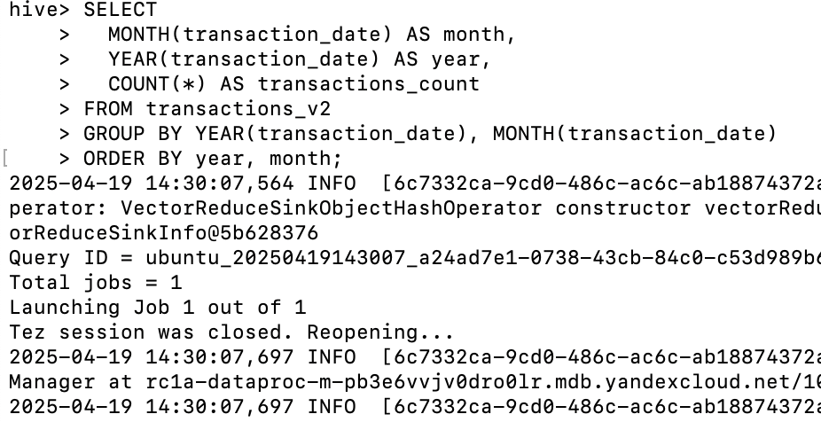


Результат:

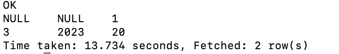

- JOIN с таблицей logs_v2 по transaction_id, чтобы посчитать количество логов на одну транзакцию, выделить самые частые категории category:

``` sql
SELECT t.transaction_id, COUNT(l.log_id) AS logs_count
FROM transactions_v2 t
LEFT JOIN logs_v2 l ON t.transaction_id = l.transaction_id
GROUP BY t.transaction_id
ORDER BY logs_count DESC;
```
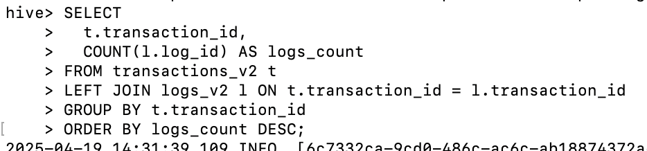


Результат:
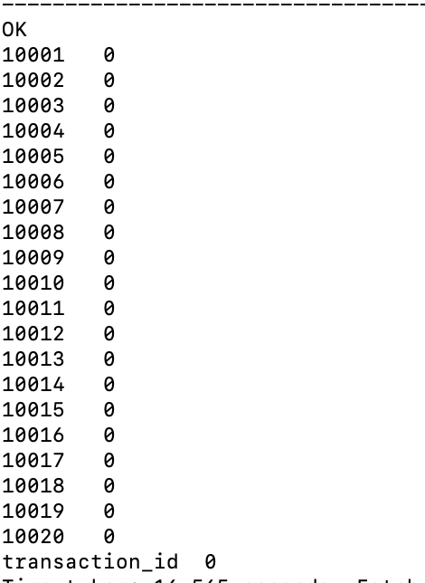
``` sql
SELECT 
  t.transaction_id,
  t.amount,
  t.currency,
  COUNT(l.log_id) AS logs_count,
  COLLECT_SET(l.category) AS categories
FROM transactions_v2 t
LEFT JOIN logs_v2 l ON t.transaction_id = l.transaction_id
GROUP BY t.transaction_id, t.amount, t.currency
ORDER BY logs_count DESC;
```
Результат
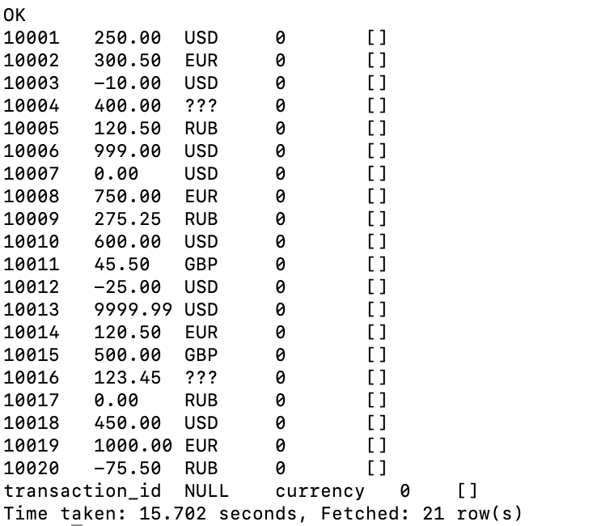

## Задание 2
Устанавливаем на убунту кликхаус
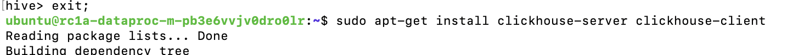

Создаём таблицу orders и заполняем её данными из файла orders.csv
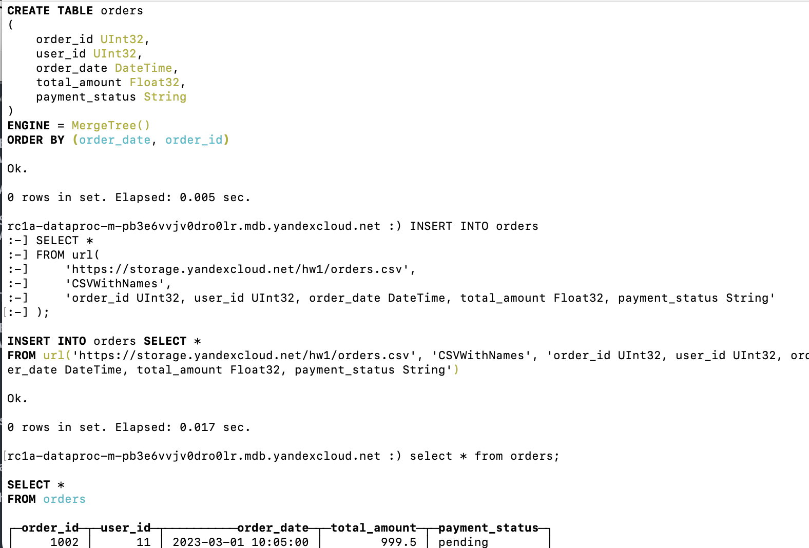

Создаём таблицу order_items и заполняем её данными из файла order_items.txt
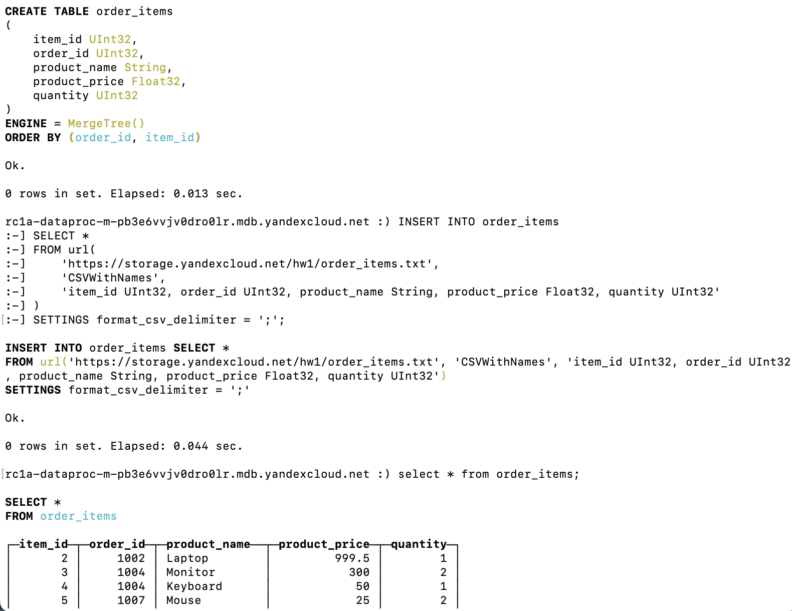


Выполнем требуемые запросы
- Группировка по payment_status: подсчитываем количество заказов, сумму (total_amount), среднюю стоимость заказа:
``` sql
SELECT 
    payment_status, 
    COUNT() AS order_count, 
    SUM(total_amount) AS total_sum, 
    ROUND(AVG(total_amount), 2) AS avg_order_amount
FROM orders 
GROUP BY payment_status
ORDER BY total_sum DESC
```
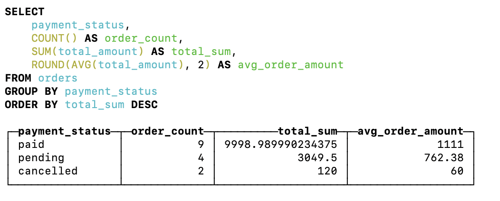


- JOIN с order_items: подсчитать общее количество товаров, общую сумму, среднюю цену за продукт:

``` sql
SELECT 
    o.order_id, 
    COUNT(i.item_id) AS items_count, 
    SUM(i.product_price * i.quantity) AS items_total, 
    ROUND(SUM(i.product_price * i.quantity) / SUM(i.quantity), 2) AS avg_item_price
FROM orders AS o 
INNER JOIN order_items AS i ON o.order_id = i.order_id
GROUP BY o.order_id
ORDER BY items_total DESC
```
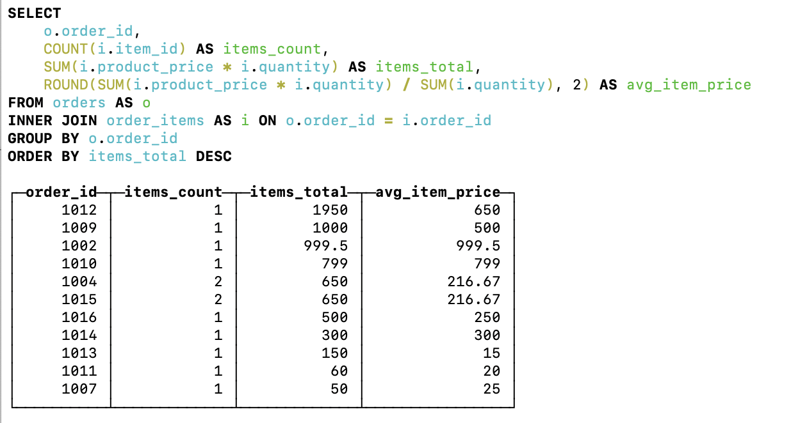


- Отдельно посмотреть статистику по датам (количество заказов и их суммарная стоимость за каждый день):
``` sql
SELECT 
    toDate(order_date) AS day, 
    COUNT() AS orders_count, 
    SUM(total_amount) AS daily_total
FROM orders 
GROUP BY day
ORDER BY day ASC
```
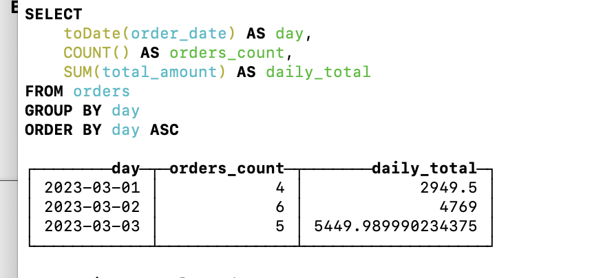

- Выделить «самых активных» пользователей (по сумме заказов или по количеству заказов:
```sql
SELECT 
    user_id, 
    SUM(total_amount) AS total_spent, 
    COUNT() AS orders_count
FROM orders 
GROUP BY user_id
ORDER BY total_spent DESC
LIMIT 5
```
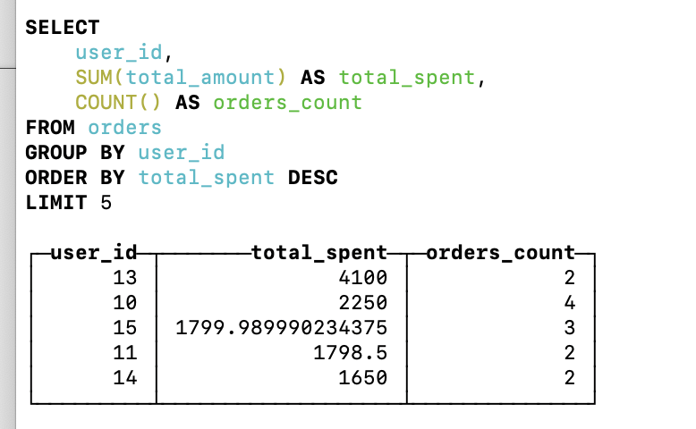

